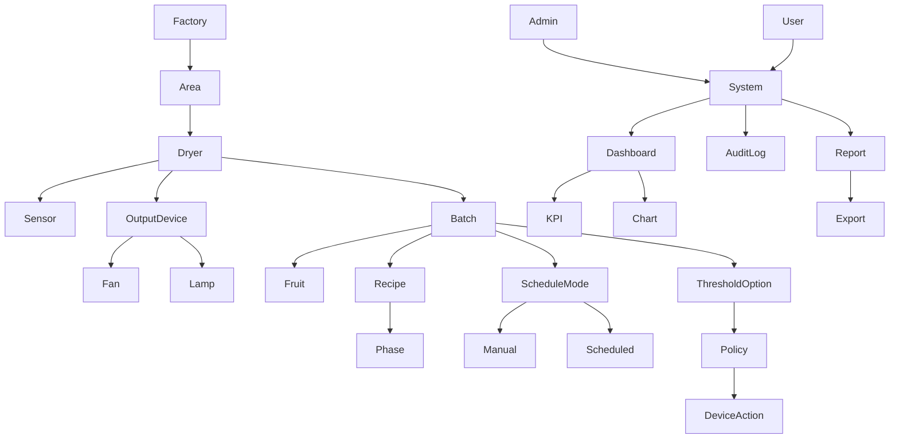

# 📦 Mô tả hệ thống Nhà máy sấy

## 1. Cấu trúc hệ thống

- Một **nhà máy** gồm nhiều **khu vực**.
- Mỗi **khu vực** chứa nhiều **máy sấy**.
- Tất cả các **máy sấy** đều có thể xử lý nhiều **loại trái cây**.

---

## 2. Cấu trúc thiết bị trong máy sấy

Mỗi **máy sấy** gồm các nhóm thiết bị chính:

- **Thiết bị cảm biến (input):** nhiệt độ, độ ẩm, trạng thái cửa, ...
- **Thiết bị chấp hành (output):** quạt, đèn.

Lưu ý:

- Một máy sấy có thể có **nhiều thiết bị output cùng loại**.
- Ví dụ: có thể cấu hình **2 quạt + 2 đèn** hoặc nhiều hơn, không giới hạn ở 1 thiết bị mỗi loại.

---

## 3. Trái cây & Công thức sấy

- Mỗi **loại trái cây** được gắn với một **công thức sấy (Drying Recipe)** riêng.
- Một công thức sấy bao gồm nhiều **giai đoạn (Phase)**:
  Phase 1 -> Phase 2 -> ... -> Phase N
- Mỗi **phase** định nghĩa các thông số:
- 🌡️ Nhiệt độ
- 💧 Độ ẩm
- ⏱️ Thời gian

---

## 4. Loại lịch trình vận hành

Hệ thống chỉ có **2 loại lịch trình chính**:

### 4.1. Thủ công (Manual)

- Người dùng tự bật/tắt và điều chỉnh thông số trong quá trình sấy.

### 4.2. Tự động theo lịch (Scheduled / Automatic)

- Hệ thống chạy theo lịch trình thời gian được cấu hình sẵn (theo phase hoặc mốc thời gian).

### 4.3. Threshold là tùy chọn bổ sung (không phải loại lịch trình)

- **Threshold-based** là một **option điều kiện** có thể gắn vào:
- Lịch trình **thủ công**
- Hoặc lịch trình **tự động theo lịch**
- Khi dữ liệu sensor đạt ngưỡng đã cấu hình, hệ thống sẽ trigger hành động tương ứng.

---

## 5. Policy (Chính sách điều khiển)

- Hệ thống có entity trung tâm: **Policy**.

### Vai trò:

- Định nghĩa các luật điều khiển cho thiết bị.
- Cấu hình điều kiện threshold (nếu bật option).
- Ánh xạ hành động cụ thể đến từng thiết bị output (ví dụ từng quạt, từng đèn).

### Liên kết:

Policy có thể liên kết với:

- Loại trái cây
- Máy sấy
- Mẻ sấy (Batch)

---

## 6. Mẻ sấy (Batch)

- Quá trình sấy được thực hiện theo **mẻ (batch)**.

### Mỗi mẻ bao gồm:

- Một **loại trái cây**
- Một **công thức sấy**
- Một **chế độ vận hành** (Manual hoặc Scheduled)
- Option **threshold** (bật/tắt tùy nhu cầu)
- Chuỗi các **phase**

---

## 7. Quy trình sử dụng (Use Case)

Ví dụ luồng sử dụng:

1. Người dùng chọn **khu vực**
2. Chọn **máy sấy**
3. Chọn **loại trái cây** (ví dụ: mít)
4. Hệ thống gợi ý **công thức sấy**
5. Người dùng chọn **chế độ vận hành**: Manual hoặc Scheduled
6. (Tùy chọn) bật **threshold option** và cấu hình ngưỡng sensor
7. Kiểm tra/cấu hình thiết bị output thực tế của máy (nhiều quạt, nhiều đèn, ...)
8. Bắt đầu **mẻ sấy**

---

## 8. Phân quyền hệ thống (RBAC)

Hệ thống có 2 vai trò chính: **User** và **Admin**.

### 8.1. User

- Theo dõi trạng thái máy sấy, sensor và thiết bị output theo phạm vi được cấp quyền.
- Tạo/chạy/dừng mẻ sấy theo công thức có sẵn.
- Chọn chế độ Manual hoặc Scheduled, bật/tắt threshold option cho mẻ đang vận hành.
- Điều chỉnh thông số trong chế độ Manual (trong giới hạn an toàn cấu hình bởi Admin).
- Xem log vận hành và report trong phạm vi khu vực/máy được phân quyền.

### 8.2. Admin

- Có toàn bộ quyền của User.
- Quản lý người dùng, vai trò và phạm vi truy cập (factory/area/dryer).
- Quản lý danh mục hệ thống: loại trái cây, công thức sấy, policy, lịch trình mẫu.
- Cấu hình thiết bị trên máy sấy (sensor, quạt, đèn), bao gồm nhiều thiết bị cùng loại.
- Thiết lập ngưỡng an toàn, quy tắc cảnh báo, luật tự động hóa.
- Truy cập toàn bộ báo cáo, dashboard toàn nhà máy và chức năng export dữ liệu.

---

## 9. Tùy chỉnh

Người dùng có thể:

- ✏️ Chỉnh sửa công thức sấy
- ➕ Tạo mới lịch trình vận hành
- ⚙️ Cấu hình policy cho từng thiết bị output cụ thể

---

## 10. Logging (Ghi log)

Hệ thống ghi lại toàn bộ hoạt động:

- Thay đổi thông số và lịch trình
- Bắt đầu / dừng mẻ sấy
- Trigger từ sensor theo ngưỡng
- Action trên từng thiết bị (ví dụ quạt 1, quạt 2, đèn 1, đèn 2)
- Nhật ký đăng nhập, phân quyền, thay đổi cấu hình quan trọng (audit log)

---

## 11. Report & Dashboard trực quan

### 11.1. Dashboard tổng quan (Realtime + Historical)

- Thẻ KPI chính:
- Số máy đang chạy / đang dừng / lỗi
- Số mẻ đang chạy, đã hoàn thành, bị hủy
- Tỷ lệ hoàn thành mẻ theo ngày/tuần/tháng
- Thời gian sấy trung bình theo loại trái cây
- Tỷ lệ cảnh báo threshold theo máy/khu vực

### 11.2. Biểu đồ trực quan bắt buộc

- Biểu đồ đường theo thời gian: nhiệt độ, độ ẩm theo từng mẻ hoặc từng máy.
- Biểu đồ trạng thái thiết bị output: thời lượng bật/tắt của từng quạt, đèn.
- Biểu đồ cột: sản lượng mẻ theo loại trái cây, theo khu vực, theo máy.
- Biểu đồ tròn hoặc stacked bar: phân bổ trạng thái mẻ (running/completed/cancelled/error).
- Heatmap hoặc bảng màu cảnh báo: tần suất vượt ngưỡng theo khung giờ.

### 11.3. Danh mục report

- Report vận hành theo ca/ngày/tuần/tháng.
- Report chất lượng mẻ: độ ổn định nhiệt/ẩm, số lần can thiệp manual.
- Report sự cố và cảnh báo: trigger threshold, lỗi thiết bị, downtime.
- Report hiệu suất thiết bị: hệ số sử dụng từng máy và từng output device.

### 11.4. Bộ lọc và xuất dữ liệu

- Bộ lọc theo thời gian, khu vực, máy sấy, loại trái cây, chế độ vận hành.
- Cho phép drill-down từ dashboard tổng quan đến chi tiết từng mẻ.
- Hỗ trợ export dữ liệu/report dạng Excel hoặc PDF (quyền Admin, hoặc User được cấp quyền).

---

## 12. Tổng kết kiến trúc

